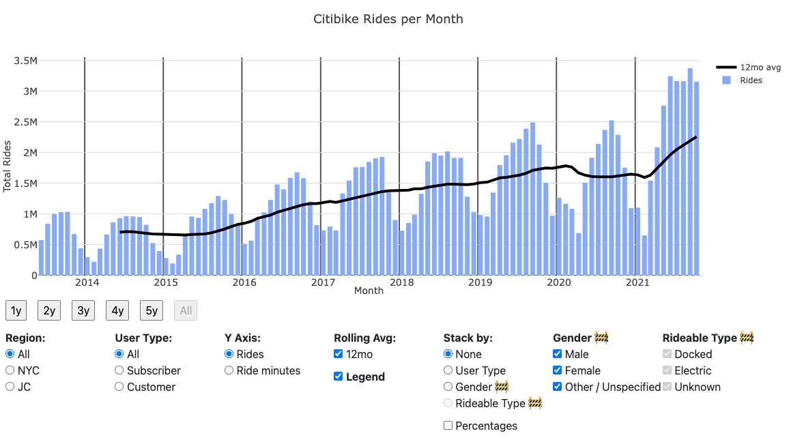
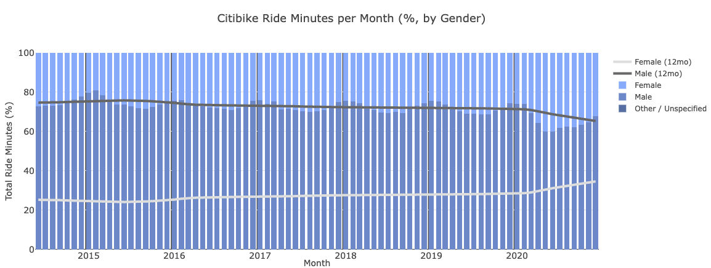

# [ctbk.dev](https://ctbk.dev/): Citibike Dashboard

[][ctbk.dev]

- [auto-updates with new data each month](#auto-update)
- [powered by cleaned, public data (derived from the official Citibike data)](#cleaned-data)
- Interactive! Filter/Stack by:
  - user type (annual "subscriber" vs. daily "customer")
  - gender (male, female, other/unspecified; historical data up to Feb 2021 only)
  - region (NYC and/or JC)
  - date range (at monthly granularity, back to system launch in June 2013)
- URL syncs with plot controls, for ease of linking to specific views, e.g.:
  - JC only: [ctbk.dev#?r=jc](https://ctbk.dev/#?r=jc)
  - Ride minute %, by gender:
    [][gender pcts plot]
    [ctbk.dev#?d=1406-2101&g=mf&pct&s=g&y=m][gender pcts plot]; Jun 2014 - January 2021, the window where 12mo rolling avgs are possible


## Cleaned, public data <a id="cleaned-data"></a>
I fixed some rough edges in [Citibike's published data][citibike system data] and published the results to [the `ctbk` Amazon S3 bucket][`s3://ctbk`].

Some issues that [`s3://ctbk`] mitigates:
- Convert original CSV's to [Parquet]
  - compressed, column-type-aware format saves some headache
  - works around issues like inconsistent `\n` vs. `\r\n` line endings
- Unzip+Normalize `.zip`s containing CSV's (which are sometimes inconsistently-named or contain erroneous extra files like `.DS_Store` macOS metadata)
- Harmonize column names across months (e.g. `User Type` vs. `usertype`)

## Automatic Updating <a id="auto-update"></a>
Every day, [a GitHub Action in this repo](https://github.com/neighbor-ryan/ctbk.dev/actions):
- checks `s3://tripdata` for a new month of official data
- if new data is found, it gets cleaned, converted to `.parquet`, and uploaded to `s3://ctbk`.

Additionally, aggregated statistics are updated, which the [ctbk.dev] app reads, meaning it should stay up to date as new data is published.

As of December 2021, this process has run successfully for 8 months ([most recently on November 6, processing October 2021 data][202110 GHA]):
```
…
Aggregating: s3://ctbk/normalized/202109.parquet
Aggregating: s3://ctbk/normalized/202110.parquet
Computing: s3://ctbk/aggregated/ymrgtb_cd_201306:202111.parquet
Wrote s3://ctbk/aggregated/ymrgtb_cd_201306:202111.parquet
Computing: s3://ctbk/aggregated/ymrgtb_cd_201306:202111.sqlite
Upload /tmp/tmp_pnfpl1s to ctbk:aggregated/ymrgtb_cd_201306:202111.sqlite
Wrote s3://ctbk/aggregated/ymrgtb_cd_201306:202111.sqlite
```

## Prior Art
[Many][ckran-20210305] [great][toddschneider-20160113] [analyses][jc-analysis-2017] [of][jc-analysis-2018] [Citibike][datastudio-analysis] [data][cl2871-analysis] [have][tableau #citibike] [been][coursera citibike viz course] [done][juanjocarin analysis] over the years. However, I've generally found them lacking in 2 ways:
- They were run once and published, and are now stale. I find them via Google, years later, and want to see the same analysis on the latest data.
- They show a few specific, static plots, but I want to ask slightly different questions of the data, or slice it another way.

My hope is that this dashboard will solve both of these issues, by:
- always staying up to date with the latest published data
- providing 5-10 orthogonal, common-sense toggles that let you easily answer a large number of basic system-level questions

## Feedback / Contributing
Feel free to [file an issue here](https://github.com/neighbor-ryan/ctbk.dev/issues) with any comments, bug reports, or feedback!

[ckran-20210305]: https://towardsdatascience.com/exploring-the-effects-of-the-pandemic-on-nyc-bike-share-usage-ab79f67ac2df
[toddschneider-20160113]: https://toddwschneider.com/posts/a-tale-of-twenty-two-million-citi-bikes-analyzing-the-nyc-bike-share-system/
[jc-analysis-2017]: https://www.bikejc.org/resources/citibikejc-2017
[jc-analysis-2018]: https://www.bikejc.org/citi-bike-usage-jersey-city-2018
[datastudio-analysis]: https://datastudio.google.com/u/0/reporting/a6fc910f-b100-4ac5-a72b-2fa35880f149/page/SKniB
[cl2871-analysis]: https://github.com/cl2871/citibike
[tableau #citibike]: https://public.tableau.com/en-gb/search/all/%23CitiBike
[coursera citibike viz course]: https://www.coursera.org/projects/visualizing-citibike-trips-tableau
[juanjocarin analysis]: http://juanjocarin.github.io/Citibike-viz/

[citibike system data]: https://www.citibikenyc.com/system-data
[citibike s3 index]: https://s3.amazonaws.com/tripdata/index.html
[`s3://ctbk`]: https://s3.amazonaws.com/ctbk/index.html
[Parquet]: https://parquet.apache.org/
[202110 GHA]: https://github.com/neighbor-ryan/ctbk.dev/runs/4125143693#step:6:396

[ctbk.dev]: https://ctbk.dev/
[gender pcts plot]: https://ctbk.dev#?d=1406-2101&g=mf&pct&s=g&y=m
