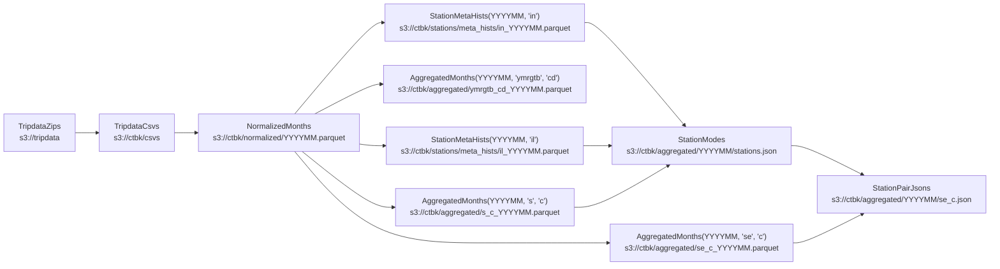

# `ctbk` python library
CLI for generating [ctbk.dev] datasets (derived from Citi Bike public data in [`s3://tripdata`]).

<!-- toc -->
- [Data flow](#data-flow)
    - [`TripdataZips` (a.k.a. `zip`s): public Citi Bike `.csv.zip` files](#zips)
    - [`TripdataCsvs` (a.k.a. `csv`s): unzipped and gzipped CSVs](#csvs)
    - [`NormalizedMonths` (a.k.a. `norm`s): normalize `csv`s](#normalized)
    - [`AggregatedMonths` (a.k.a. `agg`s): compute histograms over each month's rides:](#aggregated)
    - [`StationMetaHists` (a.k.a. `smh`s): compute station {id,name,lat/lng} histograms:](#station-meta-hists)
    - [`StationModes` (a.k.a. `sm`s): canonical {id,name,lat/lng} info for each station:](#station-modes)
    - [`StationPairJsons` (a.k.a. `spj`s): counts of rides between each pair of stations:](#station-pair-jsons)
- [Installation](#installation)
- [CLI](#cli)
    - [Subcommands: `urls`, `create`](#subcommands)
    - [Examples](#examples)
- [GitHub Actions](#ghas)
    - [`ci.yml`](#ci-yml)
    - [`www.yml`](#www-yml)
<!-- /toc -->

## Data flow <a id="data-flow"></a>



### `TripdataZips` (a.k.a. `zip`s): public Citi Bike `.csv.zip` files <a id="zips"></a>
- Released as NYC and JC `.csv.zip` files at s3://tripdata
- See [s3://tripdata](https://tripdata.s3.amazonaws.com/index.html)

### `TripdataCsvs` (a.k.a. `csv`s): unzipped and gzipped CSVs <a id="csvs"></a>
- Writes `<root>/ctbk/csvs/YYYYMM.csv`
- See also: [s3://ctbk/csvs]

### `NormalizedMonths` (a.k.a. `norm`s): normalize `csv`s <a id="normalized"></a>
- Merge regions (NYC, JC) for the same month, harmonize columns drop duplicate data, etc.
- Writes `<root>/ctbk/normalized/YYYYMM.parquet`
- See also: [s3://ctbk/normalized]

### `AggregatedMonths` (a.k.a. `agg`s): compute histograms over each month's rides: <a id="aggregated"></a>
- Group by any of several \"aggregation keys\" ({year, month, day, hour, user type, bike
  type, start and end station, …})
- Produce any \"sum keys\" ({ride counts, duration in seconds})
- Writes `<root>/ctbk/aggregated/KEYS_YYYYMM.parquet`
- See also: [s3://ctbk/aggregated/*.parquet](https://ctbk.s3.amazonaws.com/index.html#/aggregated?p=8)

### `StationMetaHists` (a.k.a. `smh`s): compute station {id,name,lat/lng} histograms: <a id="station-meta-hists"></a>
- Similar to `agg`s, but counts station {id,name,lat/lng} tuples that appear as each
  ride's start and end stations (whereas `agg`'s rows are 1:1 with rides)
- "agg_keys" can include id (i), name (n), and lat/lng (l); there are no "sum_keys"
  (only counting is supported)
- Writes `<root>/ctbk/stations/meta_hists/YYYYMM.parquet`
- See also: [s3://ctbk/stations/meta_hists](https://ctbk.s3.amazonaws.com/index.html#/stations/meta_hists)

### `StationModes` (a.k.a. `sm`s): canonical {id,name,lat/lng} info for each station: <a id="station-modes"></a>
- Computed from `StationMetaHist`s:
    - `name` is chosen as the "mode" (most commonly listed name for that station ID)
    - `lat/lng` is taken to be the mean of the lat/lngs reported for each ride's start
      and end station
- Writes `<root>/ctbk/aggregated/YYYYMM/stations.json`
- See also: [s3://ctbk/aggregated/YYYYMM/stations.json](https://ctbk.s3.amazonaws.com/index.html#/aggregated)

### `StationPairJsons` (a.k.a. `spj`s): counts of rides between each pair of stations: <a id="station-pair-jsons"></a>
- JSON formatted as `{ <start idx>: { <end idx>: <count> } }`
- `idx`s are based on order of appearance in `StationModes` / `stations.json` above
  (which is also sorted by station ID)
- Values are read from `AggregatedMonths(<ym>, 'se', 'c')`:
    - group by station start ("s") and end ("e"),
    - sum ride counts ("c")
- Writes `<root>/ctbk/aggregated/YYYYMM/se_c.json`
- See also: [s3://ctbk/stations/YYYYMM/se_c.json](https://ctbk.s3.amazonaws.com/index.html#/aggregated)

## Installation <a id="installation"></a>

Clone this repo and install this library:
```bash
git clone https://github.com/neighbor-ryan/ctbk.dev
cd ctbk.dev
pip install -e ctbk
```

Then the `ctbk` executable will be available, which exposes a subcommand for each of the stages above:

## CLI <a id="cli"></a>

<!-- `bmdfff -- ctbk` -->
<details><summary><code>ctbk</code></summary>

```
Usage: ctbk [OPTIONS] COMMAND [ARGS]...

  CLI for generating ctbk.dev datasets (derived from Citi Bike public data in `s3://`).
  ## Data flow
  ### `TripdataZips` (a.k.a. `zip`s): Public Citi Bike `.csv.zip` files
  - Released as NYC and JC `.csv.zip` files at s3://tripdata
  - See https://tripdata.s3.amazonaws.com/index.html
  ### `TripdataCsvs` (a.k.a. `csv`s): unzipped and gzipped CSVs
  - Writes `<root>/ctbk/csvs/YYYYMM.csv`
  - See also: https://ctbk.s3.amazonaws.com/index.html#/csvs
  ### `NormalizedMonths` (a.k.a. `norm`s): normalize `csv`s
  - Merge regions (NYC, JC) for the same month, harmonize columns drop duplicate data, etc.
  - Writes `<root>/ctbk/normalized/YYYYMM.parquet`
  - See also: https://ctbk.s3.amazonaws.com/index.html#/normalized
  ### `AggregatedMonths` (a.k.a. `agg`s): compute histograms over each month's rides:
  - Group by any of several "aggregation keys" ({year, month, day, hour, user type, bike
    type, start and end station, …})
  - Produce any "sum keys" ({ride counts, duration in seconds})
  - Writes `<root>/ctbk/aggregated/KEYS_YYYYMM.parquet`
  - See also: https://ctbk.s3.amazonaws.com/index.html#/aggregated?p=8
  ### `StationMetaHists` (a.k.a. `smh`s): compute station {id,name,lat/lng} histograms:
  - Similar to `agg`s, but counts station {id,name,lat/lng} tuples that appear as each
    ride's start and end stations (whereas `agg`'s rows are 1:1 with rides)
  - "agg_keys" can include id (i), name (n), and lat/lng (l); there are no "sum_keys"
    (only counting is supported)
  - Writes `<root>/ctbk/stations/meta_hists/YYYYMM/KEYS.parquet`
  - See also: https://ctbk.s3.amazonaws.com/index.html#/stations/meta_hists
  ### `StationModes` (a.k.a. `sm`s): canonical {id,name,lat/lng} info for each station:
  - Computed from `StationMetaHist`s:
    - `name` is chosen as the "mode" (most commonly listed name for that station ID)
    - `lat/lng` is taken to be the mean of the lat/lngs reported for each ride's start
      and end station
  - Writes `<root>/ctbk/aggregated/YYYYMM/stations.json`
  - See also: https://ctbk.s3.amazonaws.com/index.html#/aggregated
  ### `StationPairJsons` (a.k.a. `spj`s): counts of rides between each pair of stations:
  - JSON formatted as `{ <start idx>: { <end idx>: <count> } }`
  - `idx`s are based on order of appearance in `StationModes` / `stations.json` above
    (which is also sorted by station ID)
  - Values are read from `AggregatedMonths(YYYYMM, 'se', 'c')`:
    - group by station start ("s") and end ("e"),
    - sum ride counts ("c")
  - Writes `<root>/ctbk/aggregated/YYYYMM/se_c.json`
  - See also: https://ctbk.s3.amazonaws.com/index.html#/aggregated

Options:
  -r, --read TEXT   Set "read" behavior for `HasRoot` subclasses, `<alias>=<value>` to set specific classes by
                    alias, just `<value>` to set a global default. `<value>`s are `memory`, `disk`, and their
                    aliases, indicating whether to return disk-round-tripped versions of newly-computed
                    datasets.
  -t, --root TEXT   Path- or URL-prefixes for `HasRoot` subclasses to write to and read from. `<alias>=<value>`
                    to set specific classes by alias, just `<value>` to set a global default. `<value>`s are
                    `memory`, `disk`, and their aliases, indicating whether to return disk-round-tripped
                    versions of newly-computed datasets.
  -w, --write TEXT  Set "write" behavior for `HasRoot` subclasses, `<alias>=<value>` to set specific classes by
                    alias, just `<value>` to set a global default. `<value>`s are `never`, `ifabsent`, `always`,
                    and their aliases, indicating how to handle each dataset type already existing on disk
                    (under its `root`) vs. not.
  --s3              Alias for `--root s3:/`, pointing all classes' "root" dirs at S3
  --help            Show this message and exit.

Commands:
  zip                 Read .csv.zip files from s3://tripdata
  csv                 Extract CSVs from "tripdata" .zip files.
  normalized          Normalize "tripdata" CSVs (combine regions for each...
  partition           Separate pre-2024 parquets (`normalized/v0`) by...
  consolidate         Consolidate `normalized/YM/YM_YM.parquet` files...
  aggregated          Aggregate normalized ride entries by various...
  ymrgtb-cd           Read aggregated...
  station-meta-hist   Aggregate station name, lat/lng info from ride...
  station-modes-json  Compute canonical station names, lat/lngs from...
  station-pairs-json  Write station-pair ride_counts keyed by...
  yms                 Print one or more YM (year-month) ranges, e.g.:
```
</details>


<!-- `bmdfff -- ctbk zip --help` -->
<details><summary><code>ctbk zip --help</code></summary>

```
Usage: ctbk zip [OPTIONS] COMMAND [ARGS]...

  Read .csv.zip files from s3://tripdata

Options:
  --help  Show this message and exit.

Commands:
  urls  Print URLs for selected datasets
```
</details>

<!-- `bmdfff -- ctbk csv --help` -->
<details><summary><code>ctbk csv --help</code></summary>

```
Usage: ctbk csv [OPTIONS] COMMAND [ARGS]...

  Extract CSVs from "tripdata" .zip files. Writes to <root>/ctbk/csvs.

Options:
  --help  Show this message and exit.

Commands:
  urls    Print URLs for selected datasets
  create  Create selected datasets
  sort    Sort one or more `.csv{,.gz}`'s in-place, remove empty lines
```
</details>

<!-- `bmdfff -- ctbk normalized --help` -->
<details><summary><code>ctbk normalized --help</code></summary>

```
Usage: ctbk normalized [OPTIONS] COMMAND [ARGS]...

  Normalize "tripdata" CSVs (combine regions for each month, harmonize column
  names, etc. Populates directory `<root>/ctbk/normalized/YYYYMM/` with files
  of the form `YYYYMM_YYYYMM.parquet`, for each pair of (start,end) months
  found in a given month's CSVs.

Options:
  --help  Show this message and exit.

Commands:
  urls    Print URLs for selected datasets
  create  Create selected datasets
```
</details>

<!-- `bmdfff -- ctbk partition --help` -->
<details><summary><code>ctbk partition --help</code></summary>

```
Usage: ctbk partition [OPTIONS] [YM_RANGES_STR]

  Separate pre-2024 parquets (`normalized/v0`) by {src,start,end} months.

Options:
  --help  Show this message and exit.
```
</details>

<!-- `bmdfff -- ctbk consolidate --help` -->
<details><summary><code>ctbk consolidate --help</code></summary>

```
Usage: ctbk consolidate [OPTIONS] [YM_RANGES_STR]

  Consolidate `normalized/YM/YM_YM.parquet` files into a single
  `normalized/YM.parquet`, containing all rides ending in the given month.

Options:
  -c, --col TEXT  Columns to backfill; default: ['Birth Year', 'Gender', 'Bike
                  ID']
  -n, --dry-run   Print stats about fields that would be backfilled, but don't
                  perform any writes
  --help          Show this message and exit.
```
</details>

<!-- `bmdfff -- ctbk aggregated --help` -->
<details><summary><code>ctbk aggregated --help</code></summary>

```
Usage: ctbk aggregated [OPTIONS] COMMAND [ARGS]...

  Aggregate normalized ride entries by various columns, summing ride counts or
  durations. Writes to <root>/ctbk/aggregated/KEYS_YYYYMM.parquet.

Options:
  --help  Show this message and exit.

Commands:
  urls    Print URLs for selected datasets
  create  Create selected datasets
```
</details>

<!-- `bmdfff -- ctbk station-meta-hist --help` -->
<details><summary><code>ctbk station-meta-hist --help</code></summary>

```
Usage: ctbk station-meta-hist [OPTIONS] COMMAND [ARGS]...

  Aggregate station name, lat/lng info from ride start and end fields. Writes
  to <root>/ctbk/stations/meta_hists/KEYS_YYYYMM.parquet.

Options:
  --help  Show this message and exit.

Commands:
  urls    Print URLs for selected datasets
  create  Create selected datasets
```
</details>

<!-- `bmdfff -- ctbk station-modes-json --help` -->
<details><summary><code>ctbk station-modes-json --help</code></summary>

```
Usage: ctbk station-modes-json [OPTIONS] COMMAND [ARGS]...

  Compute canonical station names, lat/lngs from StationMetaHists. Writes to
  <root>/ctbk/aggregated/YYYYMM/stations.json.

Options:
  --help  Show this message and exit.

Commands:
  urls    Print URLs for selected datasets
  create  Create selected datasets
```
</details>

<!-- `bmdfff -- ctbk station-pairs-json --help` -->
<details><summary><code>ctbk station-pairs-json --help</code></summary>

```
Usage: ctbk station-pairs-json [OPTIONS] COMMAND [ARGS]...

  Write station-pair ride_counts keyed by StationModes' JSON indices. Writes
  to <root>/ctbk/aggregated/YYYYMM/se_c.json.

Options:
  --help  Show this message and exit.

Commands:
  urls    Print URLs for selected datasets
  create  Create selected datasets
```
</details>

### Subcommands: `urls`, `create` <a id="subcommands"></a>

Each of the `ctbk` commands above supports 3 further subcommands:
- `urls`: print the URLs that would be read from or written to
- `create`: compute and save the relevant data to those URLs (optionally no-op'ing if already present, overwriting, or failing if not present)

### Examples <a id="examples"></a>

#### `urls`: print URLS
Print URLs for 3 months of [`normalized`] data on S3:
```bash
ctbk --s3 normalized -d 202206-202209 urls
# s3://ctbk/normalized/202206.parquet
# s3://ctbk/normalized/202207.parquet
# s3://ctbk/normalized/202208.parquet
```

Print URLs for 3 months of [`normalized`] data in the local folder s3/
```bash
ctbk normalized -d 202206-202209 urls
# s3/ctbk/normalized/202206.parquet
# s3/ctbk/normalized/202207.parquet
# s3/ctbk/normalized/202208.parquet
```

#### `create`: create+save data
Compute one month of [`normalized`] ride data:
<details><summary><code>ctbk --s3 -tnorm=tmproot normalized -d202101 create</code></summary>

```bash
ctbk --s3 -tnorm=tmproot normalized -d202101 create
# Writing tmproot/ctbk/normalized/202101.parquet
# Reading s3://ctbk/csvs/202101-citibike-tripdata.csv.gz
# s3://ctbk/csvs/202101-citibike-tripdata.csv.gz: "Rideable Type" column not found; setting to "unknown" for all rows
# Reading s3://ctbk/csvs/JC-202101-citibike-tripdata.csv.gz
# s3://ctbk/csvs/JC-202101-citibike-tripdata.csv.gz: "Rideable Type" column not found; setting to "unknown" for all rows
```

Upstream data is read from S3 (`--s3` flag):
- `zips` from [`s3://tripdata`]
- `csvs` from [`s3://ctbk`]

Output [`normalized`] data is written under local folder `tmproot/` (`-tnorm=tmproot`):
```bash
tree -sh tmproot
# [  96]  tmproot
# └── [  96]  ctbk
#     └── [  96]  normalized
#         └── [ 30M]  202101.parquet
#
# 3 directories, 1 file
```

stderr messages about `Rideable Type` not being found are due to the chosen month predating the addition of that column in February 2021.

</details>

Generate all the data used by [ctbk.dev] in a local `s3/ctbk` directory (mirroring [`s3://ctbk`]):

<details><summary><code>ctbk spj create</code></summary>

- `spj` stands for [`station-pair-json`] (the final derived data product in [the diagram above](#data-flow))
- `create`ing `spj` requires `create`ing all predecessor datasets
  - Default "root" for each dataset is the local folder `s3/`
    - No existing data will be found there (on your computer), so it will be computed and saved
    - One exception to this is the initial [`TripdataZips`], which are read from [`s3://tripdata`] by default
  - Previous examples use `--s3` to point datasets to S3 locations, where they already exist
    - `--s3` is equivalent to `-ts3` or `--root s3`
    - This is in turn equivalent to `--root csvs=s3:/ --root norm=s3:/ --root agg=s3:/ ...`; all stages' URLs are prefixed with `s3:/`
    - Point at your own bucket with `-ts3://my_bucket`, which will result in files written under `s3://my_bucket/ctbk/`
</details>

⚠️ takes O(hours), streams ≈7GB of [`.csv.zip`s](#zips) from [`s3://tripdata`], writes ≈12GiB under `s3/ctbk/` locally.

### Abbreviated command names
Abbreviations for each subcommand are supported, e.g. `n` for `normalized`:
```bash
ctbk n -d2022- urls
```

## GitHub Actions <a id="ghas"></a>

### [`ci.yml`] <a id="ci-yml"></a>
[`ci.yml`] breaks each derived dataset into a separate job, [for example](https://github.com/neighbor-ryan/ctbk.dev/actions/runs/4272517971):


It also includes a final call to generate JSON used by the main plot at [ctbk.dev]:
```bash
ctbk ymrgtb-cd
```

Any changes are pushed to [the www branch], which triggers [the `www.yml` GHA](#www-yml).

### [`www.yml`] <a id="www-yml"></a>
[The `www.yml` GHA][www GHA]:
- runs on pushes to [the www branch]
- rebuilds and deploys the site

The code for the site is under [../www](../www).

[`s3://ctbk`]: https://ctbk.s3.amazonaws.com/index.html
[s3://ctbk/csvs]: https://ctbk.s3.amazonaws.com/index.html#/csvs
[`s3://ctbk/csvs`]: https://ctbk.s3.amazonaws.com/index.html#/csvs
[s3://ctbk/normalized]: https://ctbk.s3.amazonaws.com/index.html#/normalized
[`s3://ctbk/normalized`]: https://ctbk.s3.amazonaws.com/index.html#/normalized
[`s3://tripdata`]: https://tripdata.s3.amazonaws.com/index.html
[ctbk.dev]: https://ctbk.dev
[`ci.yml`]: ../.github/workflows/ci.yml
[`www.yml`]: ../.github/workflows/www.yml
[@www]: https://github.com/neighbor-ryan/ctbk.dev/tree/www
[the www branch]: https://github.com/neighbor-ryan/ctbk.dev/tree/www
[www GHA]: https://github.com/neighbor-ryan/ctbk.dev/actions/workflows/www.yml

[`zips`]: #zips
[`TripdataZips`]: #zips
[`csvs`]: #csvs
[`normalized`]: #normalized
[`NormalizedMonth`]: #normalized
[`aggregated`]: #aggregated
[`station-pair-json`]: #station-pair-jsons

[`parquet2json`]: https://github.com/jupiter/parquet2json
