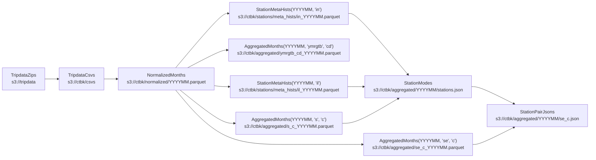

# `ctbk` python library
CLI for generating [ctbk.dev] datasets (derived from Citi Bike public data in [`s3://tripdata`]).

## Data flow



### `TripdataZips` (a.k.a. `zip`s): public Citi Bike `.csv.zip` files
- Released as NYC and JC `.csv.zip` files at s3://tripdata
- See https://tripdata.s3.amazonaws.com/index.html

### `TripdataCsvs` (a.k.a. `csv`s): unzipped and gzipped CSVs
- Writes `<root>/ctbk/csvs/<YYYYMM>.csv`
- See also: https://ctbk.s3.amazonaws.com/index.html#/csvs

### `NormalizedMonths` (a.k.a. `norm`s): normalize `csv`s
- Merge regions (NYC, JC) for the same month, harmonize columns drop duplicate data, etc.
- Writes `<root>/ctbk/normalized/<YYYYMM>.parquet`
- See also: https://ctbk.s3.amazonaws.com/index.html#/normalized

### `AggregatedMonths` (a.k.a. `agg`s): compute histograms over each month's rides:
- Group by any of several \"aggregation keys\" ({year, month, day, hour, user type, bike
  type, start and end station, …})
- Produce any \"sum keys\" ({ride counts, duration in seconds})
- Writes `<root>/ctbk/aggregated/<agg_keys>_<sum_keys>_<YYYYMM>.parquet`
- See also: https://ctbk.s3.amazonaws.com/index.html#/aggregated?p=8

### `StationMetaHists` (a.k.a. `smh`s): compute station {id,name,lat/lng} histograms:
- Similar to `agg`s, but counts station {id,name,lat/lng} tuples that appear as each
  ride's start and end stations (whereas `agg`'s rows are 1:1 with rides)
- "agg_keys" can include id (i), name (n), and lat/lng (l); there are no "sum_keys"
  (only counting is supported)
- Writes `<root>/ctbk/stations/meta_hists/<YYYYMM>.parquet`
- See also: https://ctbk.s3.amazonaws.com/index.html#/stations/meta_hists

### `StationModes` (a.k.a. `sm`s): canonical {id,name,lat/lng} info for each station:
- Computed from `StationMetaHist`s:
    - `name` is chosen as the "mode" (most commonly listed name for that station ID)
    - `lat/lng` is taken to be the mean of the lat/lngs reported for each ride's start
      and end station
- Writes `<root>/ctbk/aggregated/<YYYYMM>/stations.json`
- See also: https://ctbk.s3.amazonaws.com/index.html#/aggregated

### `StationPairJsons` (a.k.a. `spj`s): counts of rides between each pair of stations:
- JSON formatted as `{ <start idx>: { <end idx>: <count> } }`
- `idx`s are based on order of appearance in `StationModes` / `stations.json` above
  (which is also sorted by station ID)
- Values are read from `AggregatedMonths(<ym>, 'se', 'c')`:
    - group by station start ("s") and end ("e"),
    - sum ride counts ("c")
- Writes `<root>/ctbk/aggregated/<YYYYMM>/se_c.json`
- See also: https://ctbk.s3.amazonaws.com/index.html#/aggregated


<details><summary><code>ctbk</code></summary>

```
Usage: ctbk [OPTIONS] COMMAND [ARGS]...

  CLI for generating ctbk.dev datasets (derived from Citi Bike public data in `s3://`).
  ## Data flow
  ### `TripdataZips` (a.k.a. `zip`s): Public Citi Bike `.csv.zip` files
  - Released as NYC and JC `.csv.zip` files at s3://tripdata
  - See https://tripdata.s3.amazonaws.com/index.html
  ### `TripdataCsvs` (a.k.a. `csv`s): unzipped and gzipped CSVs
  - Writes `<root>/ctbk/csvs/<YYYYMM>.csv`
  - See also: https://ctbk.s3.amazonaws.com/index.html#/csvs
  ### `NormalizedMonths` (a.k.a. `norm`s): normalize `csv`s
  - Merge regions (NYC, JC) for the same month, harmonize columns drop duplicate data, etc.
  - Writes `<root>/ctbk/normalized/<YYYYMM>.parquet`
  - See also: https://ctbk.s3.amazonaws.com/index.html#/normalized
  ### `AggregatedMonths` (a.k.a. `agg`s): compute histograms over each month's rides:
  - Group by any of several "aggregation keys" ({year, month, day, hour, user type, bike
    type, start and end station, …})
  - Produce any "sum keys" ({ride counts, duration in seconds})
  - Writes `<root>/ctbk/aggregated/<agg_keys>_<sum_keys>_<YYYYMM>.parquet`
  - See also: https://ctbk.s3.amazonaws.com/index.html#/aggregated?p=8
  ### `StationMetaHists` (a.k.a. `smh`s): compute station {id,name,lat/lng} histograms:
  - Similar to `agg`s, but counts station {id,name,lat/lng} tuples that appear as each
    ride's start and end stations (whereas `agg`'s rows are 1:1 with rides)
  - "agg_keys" can include id (i), name (n), and lat/lng (l); there are no "sum_keys"
    (only counting is supported)
  - Writes `<root>/ctbk/stations/meta_hists/<YYYYMM>.parquet`
  - See also: https://ctbk.s3.amazonaws.com/index.html#/stations/meta_hists
  ### `StationModes` (a.k.a. `sm`s): canonical {id,name,lat/lng} info for each station:
  - Computed from `StationMetaHist`s:
    - `name` is chosen as the "mode" (most commonly listed name for that station ID)
    - `lat/lng` is taken to be the mean of the lat/lngs reported for each ride's start
      and end station
  - Writes `<root>/ctbk/aggregated/<YYYYMM>/stations.json`
  - See also: https://ctbk.s3.amazonaws.com/index.html#/aggregated
  ### `StationPairJsons` (a.k.a. `spj`s): counts of rides between each pair of stations:
  - JSON formatted as `{ <start idx>: { <end idx>: <count> } }`
  - `idx`s are based on order of appearance in `StationModes` / `stations.json` above
    (which is also sorted by station ID)
  - Values are read from `AggregatedMonths(<ym>, 'se', 'c')`:
    - group by station start ("s") and end ("e"),
    - sum ride counts ("c")
  - Writes `<root>/ctbk/aggregated/<YYYYMM>/se_c.json`
  - See also: https://ctbk.s3.amazonaws.com/index.html#/aggregated

Options:
  -r, --read TEXT   Set "read" behavior for `HasRoot` subclasses, `<alias>=<value>` to set specific classes by
                    alias, just `<value>` to set a global default. `<value>`s are `memory`, `disk`, and their
                    aliases, indicating whether to return disk-round-tripped versions of newly-computed
                    datasets.
  -t, --root TEXT   Path- or URL-prefixes for `HasRoot` subclasses to write to and read from. `<alias>=<value>`
                    to set specific classes by alias, just `<value>` to set a global default. `<value>`s are
                    `memory`, `disk`, and their aliases, indicating whether to return disk-round-tripped
                    versions of newly-computed datasets.
  -w, --write TEXT  Set "write" behavior for `HasRoot` subclasses, `<alias>=<value>` to set specific classes by
                    alias, just `<value>` to set a global default. `<value>`s are `never`, `ifabsent`, `always`,
                    and their aliases, indicating how to handle each dataset type already existing on disk
                    (under its `root`) vs. not.
  --s3              Alias for `--root s3:/`, pointing all classes' "root" dirs at S3
  --help            Show this message and exit.

Commands:
  aggregated
  csvs
  normalized
  sampled-zips
  station-meta-hists
  station-modes
  station-pair-jsons
  zips
```
</details>

[`s3://tripdata`]: https://tripdata.s3.amazonaws.com/index.html
[ctbk.dev]: https://ctbk.dev
