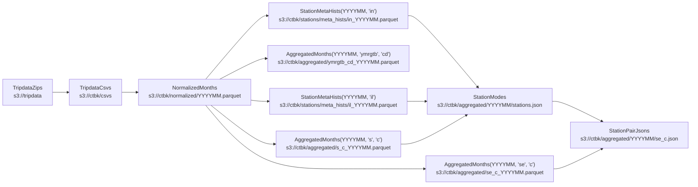

# `ctbk` python library
CLI for generating [ctbk.dev] datasets (derived from Citi Bike public data in [`s3://tripdata`]).

- [Data flow](#data-flow)
- [Usage](#usage)
  - [Generating derived data](#data-generation)
  - [GitHub Actions ([`ci.yml`])](#ghas)

## Data flow <a id="data-flow"></a>



### `TripdataZips` (a.k.a. `zip`s): public Citi Bike `.csv.zip` files
- Released as NYC and JC `.csv.zip` files at s3://tripdata
- See [s3://tripdata](https://tripdata.s3.amazonaws.com/index.html)

### `TripdataCsvs` (a.k.a. `csv`s): unzipped and gzipped CSVs
- Writes `<root>/ctbk/csvs/YYYYMM.csv`
- See also: [s3://ctbk/csvs](https://ctbk.s3.amazonaws.com/index.html#/csvs)

### `NormalizedMonths` (a.k.a. `norm`s): normalize `csv`s
- Merge regions (NYC, JC) for the same month, harmonize columns drop duplicate data, etc.
- Writes `<root>/ctbk/normalized/YYYYMM.parquet`
- See also: [s3://ctbk/normalized](https://ctbk.s3.amazonaws.com/index.html#/normalized)

### `AggregatedMonths` (a.k.a. `agg`s): compute histograms over each month's rides:
- Group by any of several \"aggregation keys\" ({year, month, day, hour, user type, bike
  type, start and end station, …})
- Produce any \"sum keys\" ({ride counts, duration in seconds})
- Writes `<root>/ctbk/aggregated/KEYS_YYYYMM.parquet`
- See also: [s3://ctbk/aggregated/*.parquet](https://ctbk.s3.amazonaws.com/index.html#/aggregated?p=8)

### `StationMetaHists` (a.k.a. `smh`s): compute station {id,name,lat/lng} histograms:
- Similar to `agg`s, but counts station {id,name,lat/lng} tuples that appear as each
  ride's start and end stations (whereas `agg`'s rows are 1:1 with rides)
- "agg_keys" can include id (i), name (n), and lat/lng (l); there are no "sum_keys"
  (only counting is supported)
- Writes `<root>/ctbk/stations/meta_hists/YYYYMM.parquet`
- See also: [s3://ctbk/stations/meta_hists](https://ctbk.s3.amazonaws.com/index.html#/stations/meta_hists)

### `StationModes` (a.k.a. `sm`s): canonical {id,name,lat/lng} info for each station:
- Computed from `StationMetaHist`s:
    - `name` is chosen as the "mode" (most commonly listed name for that station ID)
    - `lat/lng` is taken to be the mean of the lat/lngs reported for each ride's start
      and end station
- Writes `<root>/ctbk/aggregated/YYYYMM/stations.json`
- See also: [s3://ctbk/aggregated/YYYYMM/stations.json](https://ctbk.s3.amazonaws.com/index.html#/aggregated)

### `StationPairJsons` (a.k.a. `spj`s): counts of rides between each pair of stations:
- JSON formatted as `{ <start idx>: { <end idx>: <count> } }`
- `idx`s are based on order of appearance in `StationModes` / `stations.json` above
  (which is also sorted by station ID)
- Values are read from `AggregatedMonths(<ym>, 'se', 'c')`:
    - group by station start ("s") and end ("e"),
    - sum ride counts ("c")
- Writes `<root>/ctbk/aggregated/YYYYMM/se_c.json`
- See also: [s3://ctbk/stations/YYYYMM/se_c.json](https://ctbk.s3.amazonaws.com/index.html#/aggregated)

## Usage <a id="usage"></a>

Install this library:
```bash
pip install -e .
```

Then the `ctbk` executable will be available, which exposes a subcommand for each of the stages above:

<details><summary><code>ctbk</code></summary>

```
Usage: ctbk [OPTIONS] COMMAND [ARGS]...

  CLI for generating ctbk.dev datasets (derived from Citi Bike public data in `s3://`).
  ## Data flow
  ### `TripdataZips` (a.k.a. `zip`s): Public Citi Bike `.csv.zip` files
  - Released as NYC and JC `.csv.zip` files at s3://tripdata
  - See https://tripdata.s3.amazonaws.com/index.html
  ### `TripdataCsvs` (a.k.a. `csv`s): unzipped and gzipped CSVs
  - Writes `<root>/ctbk/csvs/YYYYMM.csv`
  - See also: https://ctbk.s3.amazonaws.com/index.html#/csvs
  ### `NormalizedMonths` (a.k.a. `norm`s): normalize `csv`s
  - Merge regions (NYC, JC) for the same month, harmonize columns drop duplicate data, etc.
  - Writes `<root>/ctbk/normalized/YYYYMM.parquet`
  - See also: https://ctbk.s3.amazonaws.com/index.html#/normalized
  ### `AggregatedMonths` (a.k.a. `agg`s): compute histograms over each month's rides:
  - Group by any of several "aggregation keys" ({year, month, day, hour, user type, bike
    type, start and end station, …})
  - Produce any "sum keys" ({ride counts, duration in seconds})
  - Writes `<root>/ctbk/aggregated/KEYS_YYYYMM.parquet`
  - See also: https://ctbk.s3.amazonaws.com/index.html#/aggregated?p=8
  ### `StationMetaHists` (a.k.a. `smh`s): compute station {id,name,lat/lng} histograms:
  - Similar to `agg`s, but counts station {id,name,lat/lng} tuples that appear as each
    ride's start and end stations (whereas `agg`'s rows are 1:1 with rides)
  - "agg_keys" can include id (i), name (n), and lat/lng (l); there are no "sum_keys"
    (only counting is supported)
  - Writes `<root>/ctbk/stations/meta_hists/YYYYMM/KEYS.parquet`
  - See also: https://ctbk.s3.amazonaws.com/index.html#/stations/meta_hists
  ### `StationModes` (a.k.a. `sm`s): canonical {id,name,lat/lng} info for each station:
  - Computed from `StationMetaHist`s:
    - `name` is chosen as the "mode" (most commonly listed name for that station ID)
    - `lat/lng` is taken to be the mean of the lat/lngs reported for each ride's start
      and end station
  - Writes `<root>/ctbk/aggregated/YYYYMM/stations.json`
  - See also: https://ctbk.s3.amazonaws.com/index.html#/aggregated
  ### `StationPairJsons` (a.k.a. `spj`s): counts of rides between each pair of stations:
  - JSON formatted as `{ <start idx>: { <end idx>: <count> } }`
  - `idx`s are based on order of appearance in `StationModes` / `stations.json` above
    (which is also sorted by station ID)
  - Values are read from `AggregatedMonths(YYYYMM, 'se', 'c')`:
    - group by station start ("s") and end ("e"),
    - sum ride counts ("c")
  - Writes `<root>/ctbk/aggregated/YYYYMM/se_c.json`
  - See also: https://ctbk.s3.amazonaws.com/index.html#/aggregated

Options:
  -r, --read TEXT   Set "read" behavior for `HasRoot` subclasses, `<alias>=<value>` to set specific classes by
                    alias, just `<value>` to set a global default. `<value>`s are `memory`, `disk`, and their
                    aliases, indicating whether to return disk-round-tripped versions of newly-computed
                    datasets.
  -t, --root TEXT   Path- or URL-prefixes for `HasRoot` subclasses to write to and read from. `<alias>=<value>`
                    to set specific classes by alias, just `<value>` to set a global default. `<value>`s are
                    `memory`, `disk`, and their aliases, indicating whether to return disk-round-tripped
                    versions of newly-computed datasets.
  -w, --write TEXT  Set "write" behavior for `HasRoot` subclasses, `<alias>=<value>` to set specific classes by
                    alias, just `<value>` to set a global default. `<value>`s are `never`, `ifabsent`, `always`,
                    and their aliases, indicating how to handle each dataset type already existing on disk
                    (under its `root`) vs. not.
  --s3              Alias for `--root s3:/`, pointing all classes' "root" dirs at S3
  --help            Show this message and exit.

Commands:
  zip                 Read .csv.zip files from s3://tripdata
  csv                 Extract CSVs from "tripdata" .zip files.
  normalized          Normalize "tripdata" CSVs (combine regions for each...
  aggregated          Aggregate normalized ride entries by various...
  station-meta-hist   Aggregate station name, lat/lng info from ride...
  station-modes-json  Compute canonical station names, lat/lngs from...
  station-pairs-json  Write station-pair ride_counts keyed by...
  sampled-zip         Generate test data by downsampling tripdata...

```
</details>


<details><summary><code>ctbk zip</code></summary>

```
Usage: ctbk zip [OPTIONS] COMMAND [ARGS]...

  Read .csv.zip files from s3://tripdata

Options:
  -d, --dates TEXT
  -r, --region [NYC|JC]
  --help                 Show this message and exit.

Commands:
  urls  Print URLs for selected datasets

```
</details>


<details><summary><code>ctbk csv</code></summary>

```
Usage: ctbk csv [OPTIONS] COMMAND [ARGS]...

  Extract CSVs from "tripdata" .zip files. Writes to <root>/ctbk/csvs.

Options:
  -d, --dates TEXT
  -r, --region [NYC|JC]
  --help                 Show this message and exit.

Commands:
  urls    Print URLs for selected datasets
  create  Create selected datasets
  dag     Save and `open` a graph visualization of the datasets to be...

```
</details>


<details><summary><code>ctbk normalized</code></summary>

```
Usage: ctbk normalized [OPTIONS] COMMAND [ARGS]...

  Normalize "tripdata" CSVs (combine regions for each month, harmonize column
  names, etc. Writes to <root>/ctbk/normalized/YYYYMM.parquet.

Options:
  -d, --dates TEXT
  --help            Show this message and exit.

Commands:
  urls    Print URLs for selected datasets
  create  Create selected datasets
  dag     Save and `open` a graph visualization of the datasets to be...

```
</details>


<details><summary><code>ctbk aggregated</code></summary>

```
Usage: ctbk aggregated [OPTIONS] COMMAND [ARGS]...

  Aggregate normalized ride entries by various columns, summing ride counts or
  durations. Writes to <root>/ctbk/aggregated/KEYS_YYYYMM.parquet.

Options:
  -d, --dates TEXT
  --help            Show this message and exit.

Commands:
  urls    Print URLs for selected datasets
  create  Create selected datasets
  dag     Save and `open` a graph visualization of the datasets to be...

```
</details>


<details><summary><code>ctbk station-meta-hist</code></summary>

```
Usage: ctbk station-meta-hist [OPTIONS] COMMAND [ARGS]...

  Aggregate station name, lat/lng info from ride start and end fields. Writes
  to <root>/ctbk/stations/meta_hists/KEYS_YYYYMM.parquet.

Options:
  -d, --dates TEXT
  --help            Show this message and exit.

Commands:
  urls    Print URLs for selected datasets
  create  Create selected datasets
  dag     Save and `open` a graph visualization of the datasets to be...

```
</details>


<details><summary><code>ctbk station-modes-json</code></summary>

```
Usage: ctbk station-modes-json [OPTIONS] COMMAND [ARGS]...

  Compute canonical station names, lat/lngs from StationMetaHists. Writes to
  <root>/ctbk/aggregated/YYYYMM/stations.json.

Options:
  -d, --dates TEXT
  --help            Show this message and exit.

Commands:
  urls    Print URLs for selected datasets
  create  Create selected datasets
  dag     Save and `open` a graph visualization of the datasets to be...

```
</details>


<details><summary><code>ctbk station-pairs-json</code></summary>

```
Usage: ctbk station-pairs-json [OPTIONS] COMMAND [ARGS]...

  Write station-pair ride_counts keyed by StationModes' JSON indices. Writes
  to <root>/ctbk/aggregated/YYYYMM/se_c.json.

Options:
  -d, --dates TEXT
  --help            Show this message and exit.

Commands:
  urls    Print URLs for selected datasets
  create  Create selected datasets
  dag     Save and `open` a graph visualization of the datasets to be...

```
</details>


<details><summary><code>ctbk sampled-zip</code></summary>

```
Usage: ctbk sampled-zip [OPTIONS] COMMAND [ARGS]...

  Generate test data by downsampling tripdata .csv.zip files. Writes to
  <root>/ctbk/sampled/tripdata.

Options:
  -d, --dates TEXT
  -r, --region [NYC|JC]
  --help                 Show this message and exit.

Commands:
  urls    Print URLs for selected datasets
  create  Create selected datasets
  dag     Save and `open` a graph visualization of the datasets to be...

```
</details>

Abbreviations for each subcommand are supported, e.g.:
```bash
# Save and open a graph visualization of the computations involved in creating
# `normalized` (`n`) datasets for the months from 202201 to the present
ctbk n -d2022- dag
```

See [`HasRoot`](./has_root.py) for more info about top-level `-r/--read`, `-w/--write`, and `-t/--root` parameters.

### Generating derived data <a id="data-generation"></a>
All the data can be generated in a local `s3/ctbk` directory (mirroring [`s3://ctbk`]), like:

```bash
ctbk spj create --dask
```
Notes:
- `spj` stands for `station-pair-json` (the final derived data product in the diagram above](#data-flow))
- `create`ing it involves also `create`ing all predecessor datasets
- The initial `TripdataZips` datasets are read-only and read from [`s3://tripdata`], by default.
- Other datasets default to a local `s3/` folder.
  - The `ctbk --s3` flag (equivalent to `-ts3` or `--root s3`) would point them at S3.
  - Pointing at your own bucket (`-ts3://my_bucket`) will result in files being written under `s3://my_bucket/ctbk/`.

### GitHub Actions ([`ci.yml`]) <a id="ghas"></a>
[`ci.yml`] breaks each derived dataset into a separate job, [for example](https://github.com/neighbor-ryan/ctbk.dev/actions/runs/4272517971):


It also includes a final call to generate JSON used by the main plot at [ctbk.dev]:
```bash
python -m ctbk.ymrgtb_cd -f
```

Any changes are pushed to [the www branch][@www], which triggers [the `www.yml` GHA][www GHA], which rebuilds and deploys the site. The code for the site is under [../www](../www).

[`s3://ctbk`]: https://ctbk.s3.amazonaws.com/index.html
[`s3://tripdata`]: https://tripdata.s3.amazonaws.com/index.html
[ctbk.dev]: https://ctbk.dev
[`ci.yml`]: ../.github/workflows/ci.yml
[`www.yml`]: ../.github/workflows/www.yml
[@www]: https://github.com/neighbor-ryan/ctbk.dev/tree/www
[www GHA]: https://github.com/neighbor-ryan/ctbk.dev/actions/workflows/www.yml
